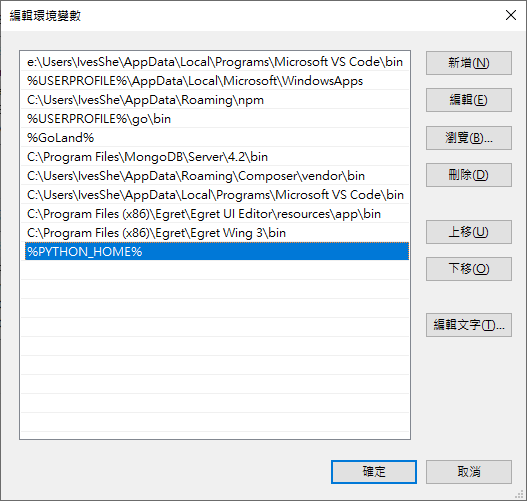
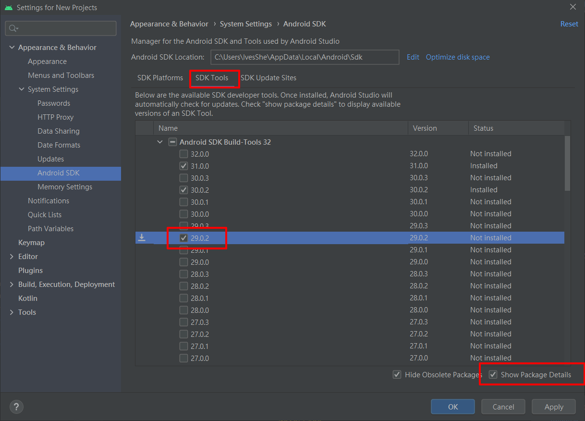
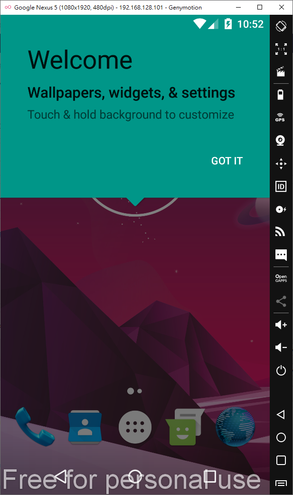

# React Native筆記

很多細節需要被記錄

官網

https://reactnative.cn/


# 環境搭建

https://reactnative.cn/docs/environment-setup

所需要軟體

- android
- java jdk 1.8
- node v12.10.0
- python 2.x (2.7.X)
- genymotion-2.12.2

## 安裝python

https://www.python.org/downloads/release/python-2715/


解決在 Windows 命令提示字元輸入 python 跳出 Windows 商店的問題

https://kheresy.wordpress.com/2020/05/06/fix-the-issue-that-open-windows-store-when-execute-python/


設置環境變數

https://ericjhang.github.io/archives/ad5450f3.html

```bash
PYTHON_HOME
C:\Python27\
```


```bash
%PYTHON_HOME%

```



```bash
python
```


## java jdk 1.8

https://www.oracle.com/java/technologies/downloads/#java8


```bash
JAVA_HOME
C:\Program Files\Java\jdk1.8.0_291
```


```bash
%JAVA_HOME%\bin
```


```bash
java
```


```bash
javac
```


## Android Studio

https://developer.android.com/studio#downloads


SDK Manager 还可以在 Android Studio 的"Preferences"菜单中找到。具体路径是Appearance & Behavior → System Settings → Android SDK。

在 SDK Manager 中选择"SDK Platforms"选项卡，然后在右下角勾选"Show Package Details"。展开Android 10 (Q)选项，确保勾选了下面这些组件（重申你必须使用稳定的代理软件，否则可能都看不到这个界面）：

Android SDK Platform 29
Intel x86 Atom_64 System Image（官方模拟器镜像文件，使用非官方模拟器不需要安装此组件)
然后点击"SDK Tools"选项卡，同样勾中右下角的"Show Package Details"。展开"Android SDK Build-Tools"选项，确保选中了 React Native 所必须的29.0.2版本。你可以同时安装多个其他版本。

然后还是在"SDK Tools"选项卡，点击"NDK (Side by side)"，同样勾中右下角的"Show Package Details"，选择20.1.5948944版本进行安装。

最后点击"Apply"来下载和安装这些组件。

SDK Manager


Android SDK Platform 29
Intel x86 Atom_64 System Image


SDK 29.0.2



NDK 20.1.5948944 


確認


安裝


SDK 默认是安装在下面的目录：

C:\Users\你的用户名\AppData\Local\Android\Sdk

我的

C:\Users\IvesShe\AppData\Local\Android\Sdk

設置環境變量

```bash
ANDROID_HOME
C:\Users\IvesShe\AppData\Local\Android\Sdk
```


 把一些工具目录添加到环境变量 Path
打开控制面板 -> 系统和安全 -> 系统 -> 高级系统设置 -> 高级 -> 环境变量，选中Path变量，然后点击编辑。点击新建然后把这些工具目录路径添加进去：platform-tools、emulator、tools、tools/bin

%ANDROID_HOME%\platform-tools
%ANDROID_HOME%\emulator
%ANDROID_HOME%\tools
%ANDROID_HOME%\tools\bin

```bash
adb devices
```


# Genymotion

手機模擬器


需要註冊帳號


建立一台虛擬機器


提示bios虛擬機器要打開


bios設定完成後，順利運行了



# 創建項目

```bash
npx react-native init rn_demo
```


```bash
adb devices
```


```bash
npx react-native run-android
```


# android strudio

連接usb手機裝置

手機本身要開啟開發者模式，並且打開usb調試

參考資料 

https://mnya.tw/cc/word/1458.html

https://www.jianshu.com/p/6131cbe22bea

安裝usb連接的sdk


從手機開啟


# 創帶版本號的新項目

```bash
 npx react-native init react_native_demo --version 0.55.4

```

# 安裝WebView

https://github.com/react-native-webview/react-native-webview/blob/HEAD/docs/Getting-Started.md

```bash
 npm install --save react-native-webview
```

```bash
npx react-native link react-native-webview
```

# 創建項目lifeServices 

```bash
npx react-native init lifeServices
```
# React Navigation

官網

https://reactnavigation.org/docs/getting-started

這邊有點坑，卡了很久，也看了很多文章，最後是靠英文官網的文檔一步一步，才完成，不過官方文檔在icon那邊的code有問題，我有再作修改


安裝的相關依賴

```bash
npm uninstall react-navigation


npm install @react-navigation/native
npm install react-native-screens react-native-safe-area-context
npm install @react-navigation/native-stack
npm install @react-navigation/bottom-tabs

 
 npm i react-native-vector-icons
```

```bash
npm i react-native-reanimated
npm i react-native-swiper

npm i react-navigation/drawer
```

## ICON網址

https://oblador.github.io/react-native-vector-icons/

# 數據請求網址

```js
http://txcourseapi.jsplusplus.com/
http://txcourseapi.jsplusplus.com/course/v2/get_course_fields
http://txcourseapi.jsplusplus.com/course/v2/get_course_datas
http://txcourseapi.jsplusplus.com/course/v2/get_courses/55
```

# 網絡

https://reactnative.cn/docs/network

# 輪播圖

```bash
npm i react-native-swiper
```


# M1 Macbook 環境搭建

參考資料

https://reactnative.cn/docs/environment-setup

## 實際安裝會碰到的問題解法

https://zhuanlan.zhihu.com/p/356820165
### 【笔记】Mac M1 搭建 React Native 环境


https://www.jianshu.com/p/19094220ed2a
### mac M1芯片 arm64架构 pod安装踩坑记录


###
https://blog.csdn.net/lihaoyuan_iOS/article/details/110947811
### React Native 安裝 pod install 錯誤 Flipper-Glog C compiler cannot create executables

https://jjnnykimo.pixnet.net/blog/post/49501205-react-native-%E5%AE%89%E8%A3%9D-pod-install-%E9%8C%AF%E8%AA%A4-flipper-glog-c-compil

# M1 Macbook項目展示

成功運行


